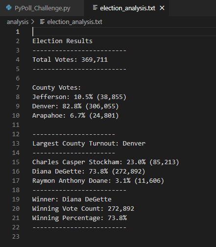

# An Analysis of Election Data and Finding the Results
In this challenge, we take the dataset that we have been working on with Seth and Tom a step further. With this dataset, we had already determined the total votes, the candidates that were voted for, the candidates' voting outcomes, and determined a winner. We now need to add code to provide county voting outcomes. Upon adding this code, we can make some new observations regarding county voting performance, as well as how that impacted the candidates' results.

## Results of the Election Audit
With a now enhanced scope of the election results, we can comment on some of the outcomes of this election:
- There was a total of 369,711 votes cast in this election
- We have each individual county's performance:
  - Jefferson County: Cast 38,855 votes, or 10.5% of the total votes
  - Denver County: Cast 306,055 votes, or 82.8% of the total votes
  - Arapahoe County: Cast 24,801 votes, or 6.7% of the total votes
    - The county with the largest number of votes cast was Denver county
- We have each individual candidate's performance:
  - Charles Casper Stockham: Received 85,213 votes, or 23.0% of the total votes
  - Diana DeGette: Received 272,892 votes, or 73.8% of the total votes
  - Raymon Anthony Doane: Recieved 11,606 votes, or 3.1% of the total votes
    - Diana DeGette won the election with 272,892 votes, 73.8% of the total votes.
- We determined this by the text output of my code:

---
 

## Election Audit Summary
This code can be used in a number of ways, across any election, and provide insight to that election. For example, we not only have the results of each county and candidate, but we can also determine that the results may have been impacted by a poor voting performance by Jefferson and Arapahoe county. This insight could be invaluable to the candidates and there parties, as it could help them reassess their future strategy to maximize their performance at the polls. If we wanted a deeper analysis, we could add code to break down how much of each county's vote that each candidate receieve. This could also add to each candidate's future strategy.
On that note, there is no reason to limit this code to this election. It could easily be applied to other elections of any type and used in any level of political elections. So long as the csv column format remains the same (Ballot ID, County, Candidate), this code will return the exact measured performances, such as total votes, county votes and percentages, candidate votes and percentages, etc.
Even if the csv column format changed, we could reallocate our variables to the appropriate indexes to pull from the correct column. We could also adjust our script to account for entirely new information. For example, if this code is used for an election with a runner and co-runner, and the co-runner's name was accounted for in a new column, we could add both the runner and co-runner's name to the candidate_result by adding another block of code to pull from both columns and adjusting the candidate_result f-string. With slight adjustment, this script can become a versatile and powerful tool for the election commission. 
